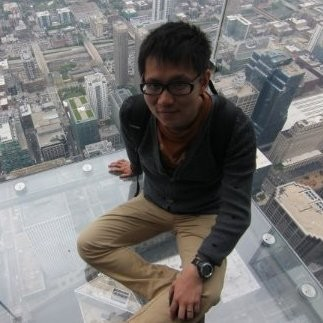

Hi, I’m hkbarton. Dad of two kids; Software Engineer @ Google (so far...) and live in California.

👆 Photo of me When I’m still young and skinny, of course I’m not young and skinny anymore...

## Some links
* [My LinkedIn Profile](https://www.linkedin.com/in/hkbarton/)
* [My X(twitter)](https://x.com/hkbarton1983)

## My professional work
Most of my professional time, I’m a tiny screw in the corp(牛马). I’ve tried (twice) to start my own company but they both failed. Nowadays I’m mostly passion about building some useful small things, investing and dreaming about earlier retirement from my corp work.
* **2005 - 2010**: Early career, in Kingsoft and Newegg.
* **2010 - 2011**: First startup try.
* **2011 - 2014**: Return to Newegg, migrating to US.
* **2014 - 2018**: First Silicon Valley job, Box.
* **2018 - 2021**: Return to China, second startup try and some consulting works.
* **2021 - now**: Return to US, Google.
* **????**: Retired, pursue my own passion.

## My “top” list
### Best Games
1. The Last of Us Part I
2. The Last of Us Part II
3. Call of Duty 4 modern warfare 1
4. Call of Duty 6 modern warfare 2
5. Uncharted series
### Best Movies
1. Interstellar
2. Inception
3. Manchester by the Sea
4. Shutter Island
5. CODA
### Best TV Series
1. Silo
2. Friends
3. Silicon Valley
